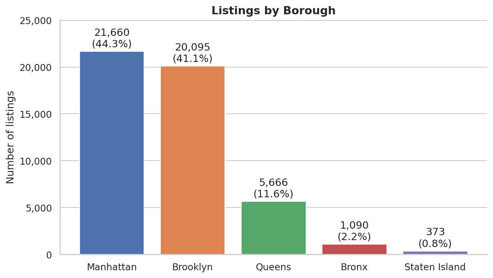
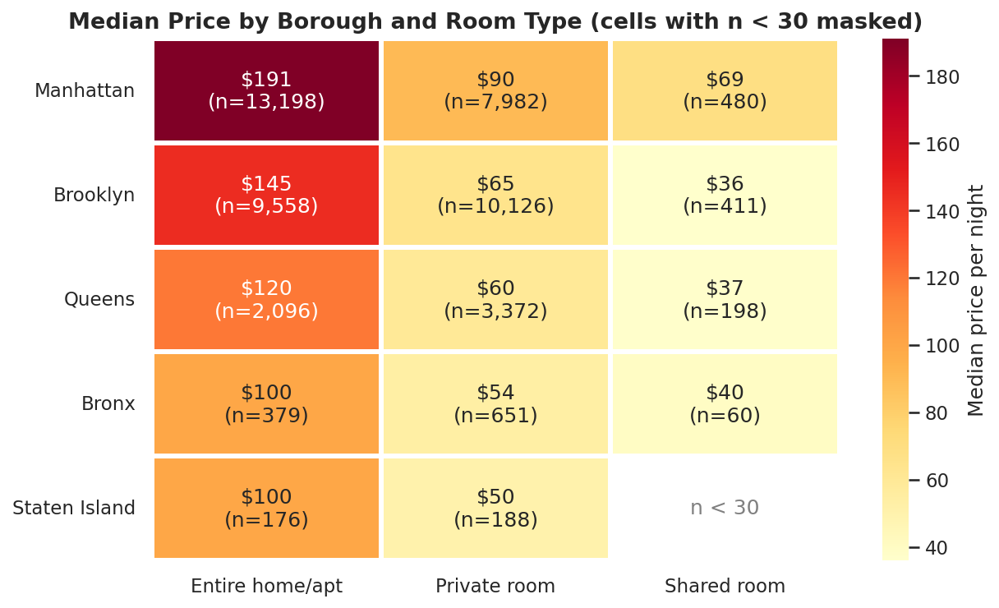
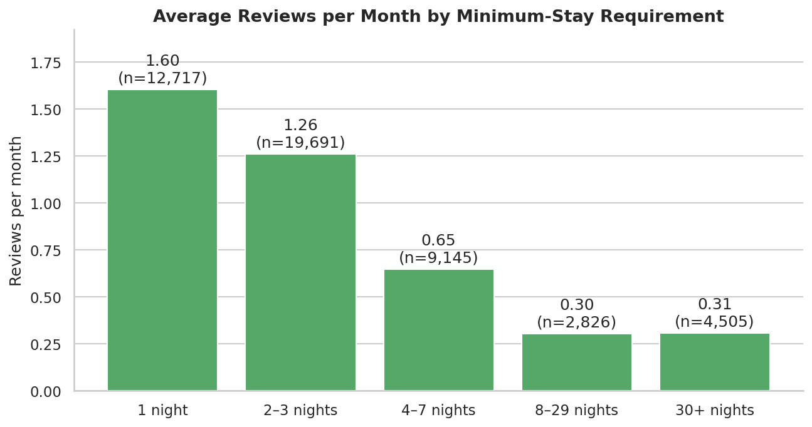
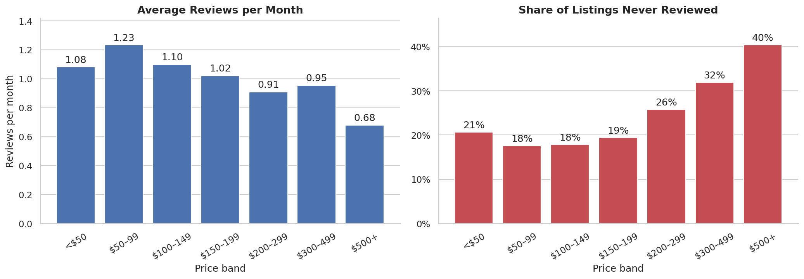
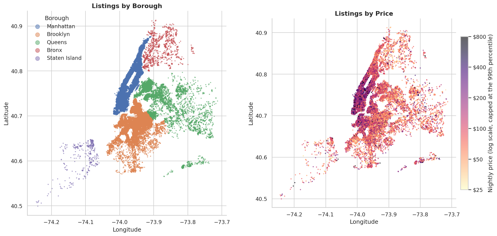

# Airbnb NYC Bookings Analysis


Exploratory data analysis of **48,895 New York City Airbnb listings (2019)**. The project cleans and validates the raw data, then answers four business questions: where supply is concentrated, how prices behave, which listing decisions coincide with stronger guest engagement, and how much of the market is run by professional multi-listing hosts.

**Notebook:** [`Airbnb_Bookings_Analysis.ipynb`](Airbnb_Bookings_Analysis.ipynb) — fully executed, with all charts rendered inline.

---

## Table of contents

- [Business problem](#business-problem)
- [Key findings](#key-findings)
- [Dataset](#dataset)
- [Approach](#approach)
- [Selected visuals](#selected-visuals)
- [Recommendations](#recommendations)
- [Limitations](#limitations)
- [Tech stack](#tech-stack)
- [Repository structure](#repository-structure)
- [Getting started](#getting-started)
- [Author](#author)

## Business problem

Airbnb is a two-sided marketplace: guests want the right place at the right price, and hosts want to know how to position a listing so it gets booked. This analysis takes the view of a marketplace strategy team that also wants to give practical guidance back to hosts.

| Question | Focus |
|---|---|
| **Supply** | Where are listings concentrated — borough, neighbourhood, room type? |
| **Pricing** | What does a typical nightly price look like, and what drives it? |
| **Engagement** | Which price points and stay policies coincide with more guest reviews? |
| **Hosts** | How much of the market is run by single-property hosts versus professional operators? |

## Key findings

| Area | Finding |
|---|---|
| **Supply** | Manhattan and Brooklyn hold **85.4%** of listings; Queens adds 11.6%. Williamsburg (3,919) and Bedford-Stuyvesant (3,710) are the two largest neighbourhoods. |
| **Room types** | Entire homes 52.0%, private rooms 45.7%, shared rooms 2.4%. |
| **Pricing** | Median nightly price is **$106** (mean $153, pulled up by a long luxury tail); 44.7% of listings cost under $100. |
| **Location premium** | Manhattan's median ($150) is 1.67x Brooklyn's ($90). The premium persists within each room type — entire homes: $191 vs $145; private rooms: $90 vs $65. |
| **Room type premium** | An entire home costs 2.3x a private room at the median ($160 vs $70). |
| **Stay rules** | Listings with a 1-night minimum average **1.60 reviews per month**, versus **0.30** for listings requiring 8+ nights. |
| **Price vs. engagement** | Review rates stay at roughly 1.0–1.2 per month through the $200 mark and fall to 0.68 at $500+, where 40% of listings have never been reviewed (18% in the $50–99 band). |
| **Availability** | 35.9% of listings show zero open days in the next 365. |
| **Hosts** | 343 hosts with 6+ listings control 9.8% of all listings — 13.6% in Manhattan vs 5.5% in Brooklyn — and keep inventory open far longer (median 310 available days vs 6 for single-listing hosts). |
| **Statistics** | Borough explains a large share of price variation (Kruskal-Wallis, ε² = 0.144); a random Manhattan entire home costs more than a random Brooklyn one 66.9% of the time (Mann-Whitney). |

## Dataset

- **Source:** [New York City Airbnb Open Data](https://www.kaggle.com/datasets/dgomonov/new-york-city-airbnb-open-data) on Kaggle (2019 snapshot).
- **Size:** 48,895 rows × 16 columns — one row per listing.
- **Not bundled:** the CSV is not committed to this repository. See [`data/README.md`](data/README.md) for download instructions.

| Column group | Columns |
|---|---|
| Identifiers | `id`, `name`, `host_id`, `host_name` |
| Location | `neighbourhood_group`, `neighbourhood`, `latitude`, `longitude` |
| Listing | `room_type`, `price`, `minimum_nights`, `availability_365` |
| Activity | `number_of_reviews`, `last_review`, `reviews_per_month` |
| Host | `calculated_host_listings_count` |

## Approach

The whole workflow lives in one notebook and follows a repeatable pipeline.

1. **Audit** — data types, missing values, duplicates, outliers and impossible values.
2. **Clean** — a single `clean_listings()` function that logs how many rows each step affects.
3. **Engineer features** — ordered price bands, minimum-stay bands and host segments (single, 2–5, 6+ listings).
4. **Validate** — assertion checks stop the notebook if the cleaned data breaks an expectation.
5. **Explore** — 17 charts organised as univariate, bivariate and multivariate analysis, each with a stated rationale and the numbers behind it.
6. **Test** — Kruskal-Wallis and Mann-Whitney tests with effect sizes, since price is far from normal.
7. **Recommend** — findings translated into actions, with limitations stated openly.

### Data cleaning decisions

| Issue | Decision | Why |
|---|---|---|
| `last_review` in mixed text formats | Parsed as month-first dates | Treating the values as day-first silently swaps day and month and produces dates past the end of the collection window |
| 10,052 missing `reviews_per_month` | Filled with 0 | Missing exactly when the listing has zero reviews (verified in code) |
| Missing `last_review` | Left empty | A filled-in date would fabricate review activity |
| 11 listings priced at $0 | Removed | Not a valid nightly price |
| 14 minimum stays above one year | Clipped to 365 nights | Entry errors; the rest of each row is valid |
| Extreme prices | Kept; medians and capped views used | Luxury listings are real and distort means, not medians |
| Possible repeat listings (233 rows) | Kept after a sensitivity check | Each has a unique ID and coordinates; removing them changes no conclusion |

### Counting listings correctly

`calculated_host_listings_count` is a host-level value repeated on every row a host owns. Summing it across rows counts a host with 300 listings 300 times. Every listing count in this project is a row count, never a sum of that column.

## Selected visuals

<p align="center">
  
  
</p>
<p align="center">
  
  
</p>
<p align="center">
  
</p>

## Recommendations

1. **Build price guidance around location and room type.** Give hosts a benchmark for their neighbourhood and room type, shown as a median and range rather than a citywide average.
2. **Test shorter minimum stays.** Invite hosts with 8+ night minimums to trial 1–3 nights, ideally as a controlled experiment. The gap is large but the data alone cannot show it is causal.
3. **Support premium listings.** Listings above $300 are much more likely to sit unreviewed; pricing and listing-quality nudges would help this segment most.
4. **Treat professional operators as their own segment.** They behave differently from single-property hosts and need different tooling, policies and metrics.
5. **Target growth by neighbourhood, not just borough.** Large mid-priced Brooklyn neighbourhoods and small premium Manhattan ones call for different strategies; expect lower revenue per listing in the outer boroughs.

## Limitations

- **Reviews are not bookings.** Every engagement finding uses reviews as a proxy for guest activity.
- **Availability is ambiguous.** Zero available days can mean fully booked, blocked by the host, or inactive.
- **Prices are asking prices**, not what guests actually paid.
- **One snapshot, one year.** No seasonality or trend analysis, and no causal claims.
- **No guest-side data**, so satisfaction and guest behaviour cannot be measured.

**Possible next steps:** a price-prediction baseline (regularised linear model vs gradient boosting with cross-validation), text analysis of listing titles, spatial clustering of price zones, and an interactive dashboard.

## Tech stack

Python · pandas · NumPy · Matplotlib · Seaborn · SciPy · Jupyter

## Repository structure

```
airbnb-nyc-bookings-analysis/
├── Airbnb_Bookings_Analysis.ipynb   # Full analysis (executed)
├── README.md
├── requirements.txt
├── LICENSE
├── .gitignore
├── data/
│   └── README.md                    # Where to download the dataset
└── images/                          # Charts exported by the notebook
```

## Getting started

**Requirements:** Python 3.10 or newer.

```bash
# 1. Clone the repository
git clone https://github.com/<your-username>/airbnb-nyc-bookings-analysis.git
cd airbnb-nyc-bookings-analysis

# 2. Create and activate a virtual environment
python -m venv .venv
source .venv/bin/activate        # Windows: .venv\Scripts\activate

# 3. Install dependencies
pip install -r requirements.txt

# 4. Add the dataset (see data/README.md), then launch the notebook
jupyter notebook Airbnb_Bookings_Analysis.ipynb
```

Run all cells top to bottom (**Kernel → Restart & Run All**). The notebook stops with a clear message if the dataset is missing, and it re-exports the charts to `images/` on each run (set `SAVE_FIGURES = False` in the setup cell to disable this).

## Author

**Aryan Roy** — Data Analyst based in Kolkata, India.
MCS in AI/ML, IIT Guwahati · BBA, DAITM.

- LinkedIn: `<your-linkedin-url>`
- GitHub: [`@<your-username>`](https://github.com/<your-username>)

## License

Released under the [MIT License](LICENSE). The dataset belongs to its original publishers; see the Kaggle page for its terms.
